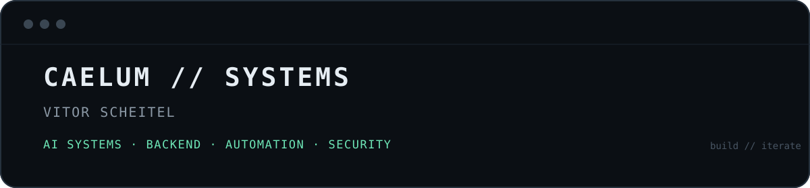
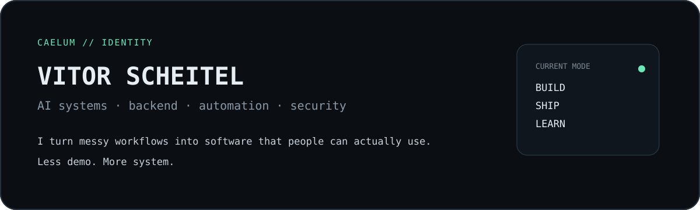
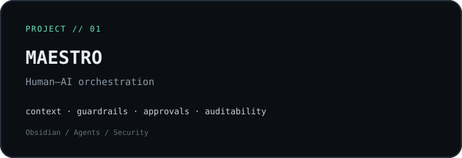
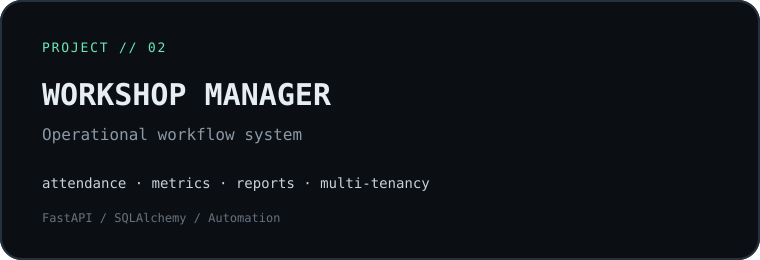

<p align="center">
  
</p>

<p align="center">
  
</p>

## About

I build **backend systems, automation tools and AI-assisted workflows** — usually around messy real-world processes that need structure, traceability and less manual work.

My current direction sits between **software engineering, AI agents, cybersecurity and human–AI orchestration**.

I care more about software that is actually used than projects that only look good in a portfolio.

---

## Selected work

<a href="https://github.com/caelum2888/Maestro-Segundo-Cerebro">
  
</a>
<a href="https://github.com/caelum2888/workshop-manager">
  
</a>

### Maestro

A structured knowledge and governance layer for human–AI development workflows.

The project explores how agents can work with better **context, guardrails, approvals, handoffs and auditable evidence** without removing human control.

### Workshop Manager

A portfolio-safe version of software built from a real operational workflow.

It handles **students, attendance, enrollment lifecycle, deterministic metrics, reporting, multi-tenancy and optional AI-assisted text generation**.

---

## What I'm working on

```text
[01] backend systems that remove repetitive work
[02] AI agents with explicit boundaries and human approval
[03] software architecture, Linux and security
[04] turning internal tools into reliable products
```

---

## Toolbox

```text
CODE        Python · JavaScript
BACKEND     FastAPI · REST APIs · SQLAlchemy
SYSTEMS     Linux · Docker · Git
AI          OpenAI · Claude · Gemini · Agent Workflows
WORKFLOW    GitHub · VS Code · Obsidian
```

---

## Build principles

**Useful over flashy.**  
The interface can be simple if the workflow is solid.

**Deterministic where it matters.**  
Business rules and metrics should not depend on an LLM when normal code is the right tool.

**Humans stay in control.**  
AI should assist decisions and execution without hiding responsibility.

**Understand the system. Then improve it.**

---

<p align="center">
  <sub>caelum2888 // building systems, breaking repetitive work</sub>
</p>
