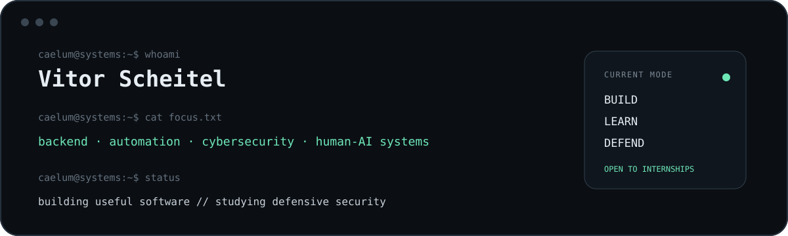

<p align="center">
  
</p>

<p align="center">
  <a href="https://git.io/typing-svg">
    
  </a>
</p>

<p align="center">
  
</p>

<p align="center">
  <a href="https://github.com/caelum2888/Maestro-Segundo-Cerebro">
    
  </a>
  <a href="https://github.com/caelum2888/workshop-manager">
    
  </a>
</p>

---

## Who I am

I build software for situations where **spreadsheets, repetitive work, scattered context and manual decisions start getting in the way**.

My work sits mostly around:

```text
backend systems
automation
AI-assisted workflows
security-minded architecture
internal tools that solve real operational problems
```

I’m especially interested in building systems where AI is useful **without becoming the system of record or removing human control**.

---

## Selected systems

<a href="https://github.com/caelum2888/Maestro-Segundo-Cerebro">
  
</a>
<a href="https://github.com/caelum2888/workshop-manager">
  
</a>

### Maestro — Human–AI Orchestration

A structured operational layer for AI-assisted development.

It explores how to preserve **context, approvals, guardrails, risks, handoffs and auditability** while agents participate in real workflows.

### Workshop Manager

Software derived from a real operational workflow for managing **students, attendance, enrollment lifecycle, metrics and monthly reporting**.

The public repository is a portfolio-safe version of the system.

---

## Stack

<p align="center">
  
</p>

```text
BACKEND      FastAPI · REST APIs · SQLAlchemy
SYSTEMS      Linux · Docker · Git
AI           OpenAI · Claude · Gemini · Agent Workflows
WORKFLOW     GitHub · VS Code · Obsidian
```

---

## What I optimize for

<table>
  <tr>
    <td><strong>Useful systems</strong><br/>Software should solve a real workflow, not exist only as a demo.</td>
    <td><strong>Deterministic core</strong><br/>Rules, metrics and critical behavior should stay predictable.</td>
  </tr>
  <tr>
    <td><strong>Human control</strong><br/>AI should assist execution without hiding responsibility.</td>
    <td><strong>Traceability</strong><br/>Important actions, decisions and state changes should be understandable later.</td>
  </tr>
</table>

---

## Current direction

```text
01  Backend & software architecture
02  AI agents & orchestration
03  Cybersecurity & Linux
04  Automation of real operational workflows
05  Turning internal tools into products
```

---

<p align="center">
  <strong>Understand the system. Then improve it.</strong>
</p>

<p align="center">
  <sub>caelum2888 // CAELUM SYSTEMS</sub>
</p>
