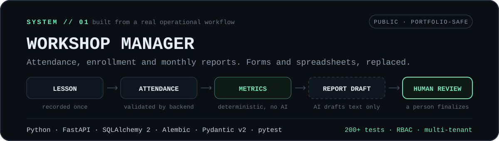
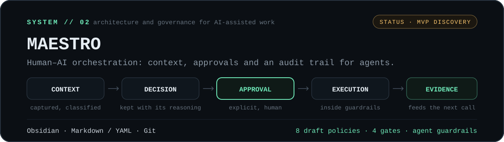
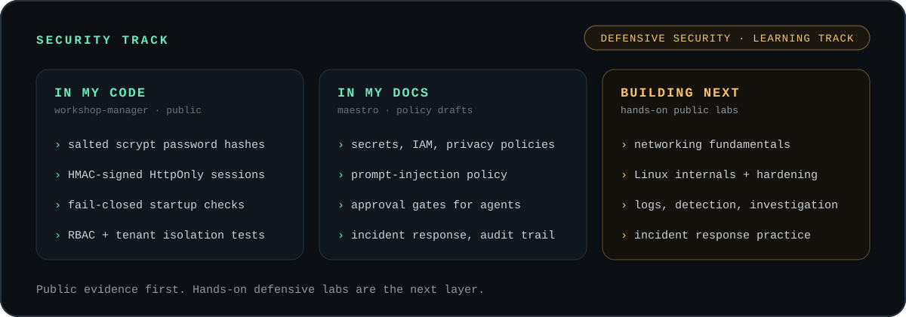
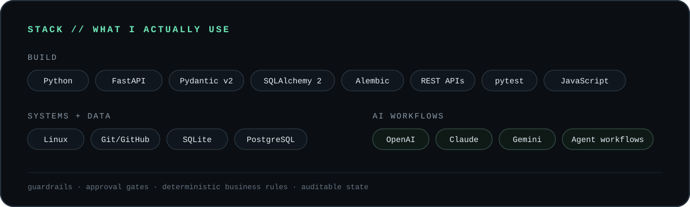

  

I build backend systems and automation for workflows that were living in forms and spreadsheets. What I care about most are the unglamorous parts: rules that stay predictable, actions you can trace later, and a person who stays in charge when AI is involved.

I'm early in my career and looking for an **internship** in backend, infrastructure, automation or defensive security. I'm deliberately building toward defensive security while backend and automation remain my strongest public proof — I'd rather show the work than borrow a title I haven't earned yet.

Some of what I build is private. What's below is what I can show in detail.

---

## Systems

### If you only have two minutes

| | Open this |
| --- | --- |
| Workshop Manager | [`app/services/`](https://github.com/caelum2888/workshop-manager/tree/main/app/services) (business rules live here, not in the routers) · [`tests/test_tenant_isolation.py`](https://github.com/caelum2888/workshop-manager/blob/main/tests/test_tenant_isolation.py) · [`app/session.py`](https://github.com/caelum2888/workshop-manager/blob/main/app/session.py) |
| Maestro | [`AGT-002` prompt-injection policy](https://github.com/caelum2888/Maestro-Segundo-Cerebro/blob/main/21%20Pol%C3%ADticas%20e%20Pr%C3%A1ticas%20de%20Desenvolvimento/Pol%C3%ADticas%20da%20Empresa/05-AGT-002-Prompt-Injection.md) · [`CHK-002` pull request gate](https://github.com/caelum2888/Maestro-Segundo-Cerebro/blob/main/23%20Checklists%20e%20Gates/CHK-002-Pull-Request.md) · [decision log](https://github.com/caelum2888/Maestro-Segundo-Cerebro/blob/main/01%20Projeto%20Maestro/15%20Decis%C3%B5es/REGISTRO-DE-DECISOES.md) |

---

## Rules I keep

| Rule | Where it shows up |
| --- | --- |
| **AI never does the math.** | In Workshop Manager, attendance metrics are deterministic. The LLM only drafts text from records that already exist, and the app works without it. |
| **A person finalizes.** | Reports go draft → review → final, and finalizing is a human action. Maestro treats approvals the same way: explicit, never implied. |
| **Fail closed.** | The server won't start without a 32+ character `SECRET_KEY`, or against a missing or outdated database schema. |
| **One place for the rules.** | Business logic and tenant isolation sit in the service layer, with tests, so the web UI, scripts and future agents all hit the same checks. |
| **Data is not instructions.** | Maestro's AGT-002 draft: anything an agent retrieves can't change its permissions or goals. |

---

## Security track

  

The first two columns are evidence already public. The third is the hands-on track I'm turning into labs next.

---

## Stack

  

---

<!-- Add LinkedIn and/or a professional email here when ready. -->

  <strong>Understand the system. Then improve it.</strong>

  caelum2888 // CAELUM SYSTEMS

